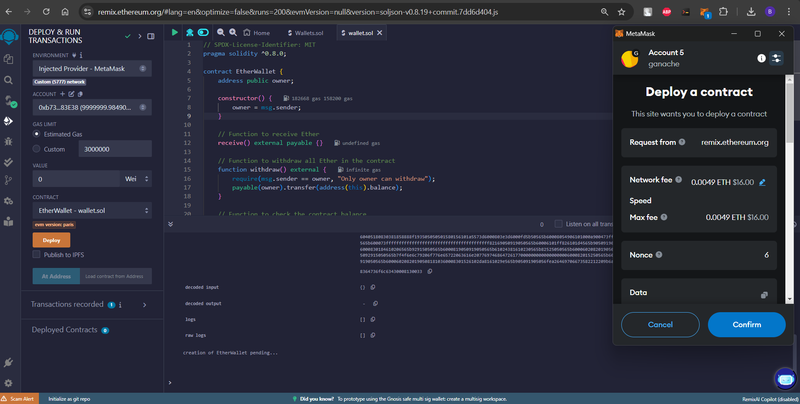
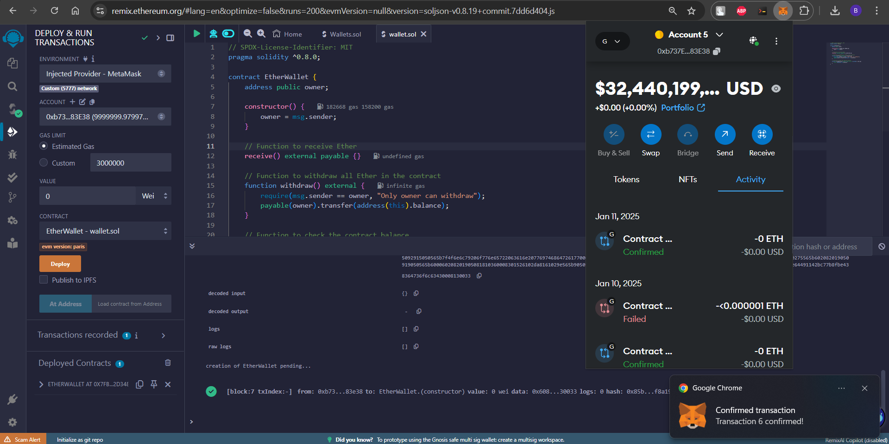
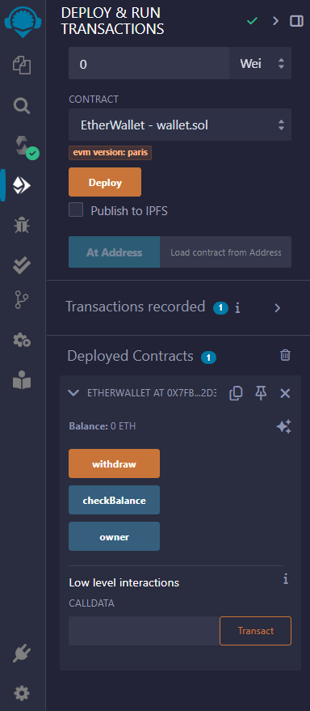
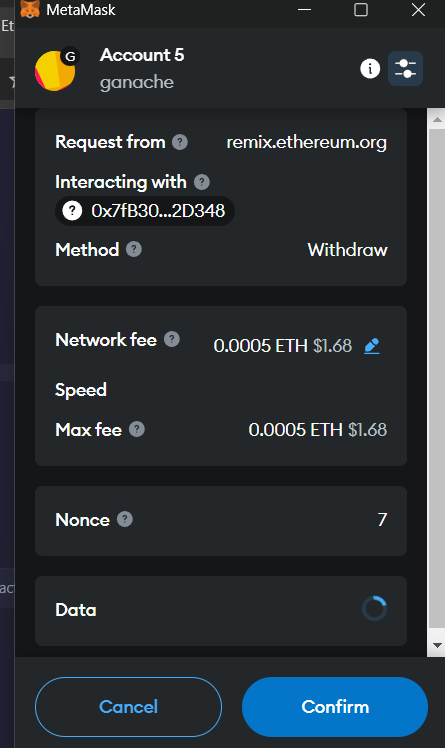
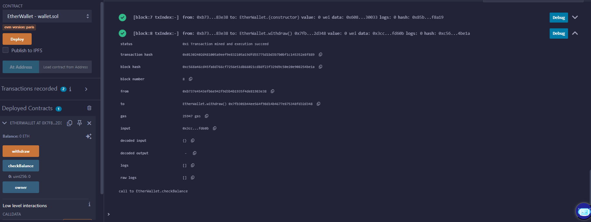
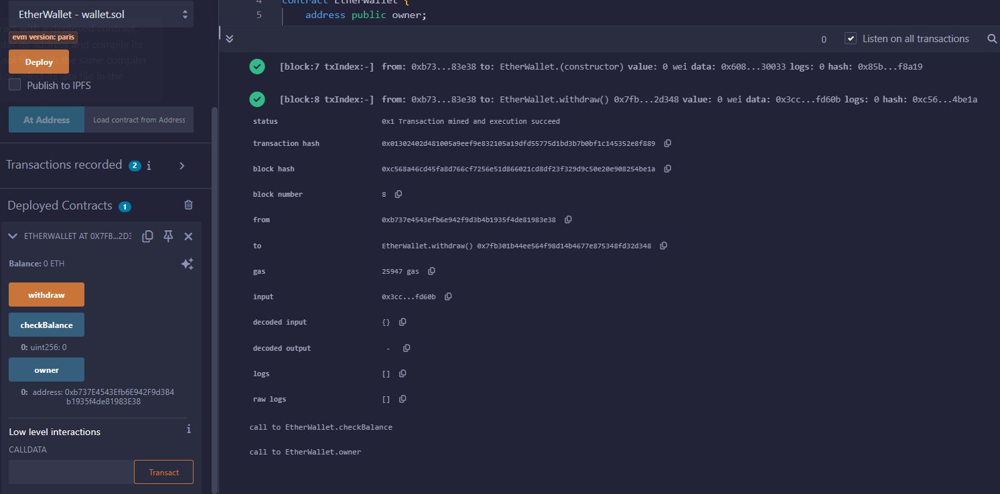

# ganache-smart-contract

## Overview

EtherWallet is a Solidity-based smart contract designed for secure storage and management of Ether. The contract ensures withdrawals are restricted to the owner's account and provides functionality to check the contract's balance. This repository also includes a Node.js script to interact with the contract deployed on a local Ethereum blockchain using Ganache.

## Features

- Secure Ether Storage: Ether sent to the contract is securely stored.

- Owner-Restricted Withdrawals: Only the owner of the contract can withdraw the stored Ether.

- Balance Checking: Retrieve the current Ether balance of the contract.

## Usage Instructions

### Prerequisites

1. Node.js and npm installed on your machine.

2. Ganache for local Ethereum blockchain simulation.

3. Remix IDE or any other tool to deploy the Solidity smart contract.

## Installation Steps

1. Clone the repository:
    ```bash
    git clone <repository-url>
    cd EtherWallet

2. Install the required dependencies:
    ```bash
    npm install web3

## Demo Screenshots


## Contract Deployment in Remix
1. 

2. 

3. 
## Script Usage Example

### Withdraw
1. 

2. 

### Check balance
1. 

### Ownwership
1. 